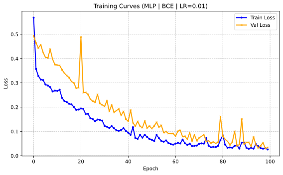
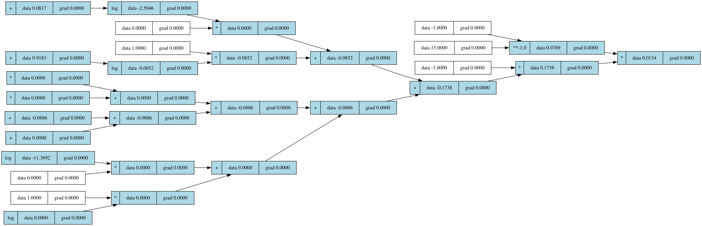

# The AutoGrad Engine

A lightweight, PyTorch-style scalar autograd engine and deep learning library built from scratch in pure Python.

This project implements a reverse-mode automatic differentiation engine over dynamically built directed acyclic graphs (DAGs). Without relying on C++ backends, external libraries, or NumPy for its core autograd mechanics, it features a fully modular neural network API, adaptive optimizers, robust loss functions, and advanced diagnostic graph visualization tools using Graphviz.

## Features

* **Autograd Engine:** The Scalar `Value` objects dynamically track operations and compute gradients. It supports severals of standard math operations (e.g., `exp`, `log`, `pow` (`__rpow__`), and non-linear activations (`relu`, `sigmoid`, `tanh`, `sin`, `cos`)).

* **Memory-Safe Backpropagation:** It utilizes an **iterative stack-based topological sort** which completely bypasses Python's native `RecursionError` and the need for `sys.setrecursionlimit`, thus allowing for the generation of infinitely deep computational graphs.

* **Mini-Batch Gradient Descent:** Implements robust batch-processing logic to ensure stable and low-variance weight updates, promoting smooth convergence on real-world datasets.

* **Rich Set of Optimizers:** Includes implementations of SGD (with momentum), RMSprop, Adam, and AdamW (with decoupled weight decay) built from scratch.

* **Rich Set of Loss Functions:** Built-in loss functions for regression and classification, including MSE, L1 (MAE), Binary Cross-Entropy (BCE), Categorical Cross-Entropy (CCE), and Hinge Loss.

* **CLI Training Loop:** A fully-featured training script (`main.py`) complete with early stopping, dynamic epoch shuffling, train/validation splitting, and a live terminal UI powered by `rich`.

* **Computational Graph Visualizer:** Exports graph telemetry to render trimmed Directed Acyclic Graphs (DAGs) using Graphviz, allowing us to visually verify the exact mathematical operations and node topology.

---

## Project Structure

```bash

├── AUTOGRAD
│   ├── data_procs_engine.py
│   ├── Engine.py
│   ├── Modules.py
│   ├── Optimizers.py
│   ├── __pycache__
│   │   ├── data_procs_engine.cpython-314.pyc
│   │   ├── Engine.cpython-314.pyc
│   │   ├── Modules.cpython-314.pyc
│   │   ├── Optimizers.cpython-314.pyc
│   │   ├── test_Engine.cpython-314-pytest-9.1.1.pyc
│   │   └── Utils.cpython-314.pyc
│   ├── test_Engine.py
│   └── Utils.py
├── dag_visualizer.py
├── Downloaded Data # All the unprocessed data sits here
│   └── heart.csv
├── main.py
├── Model # All the data and artifacts generated at runtime of programme is stored in this directory.
│   ├── computational_graph
│   ├── computational_graph.svg
│   ├── model.json
│   ├── telemetry.json
│   └── training.svg
├── Pre-processed_data # All the processed data sits here
│   └── heart_clean.csv
├── __pycache__
│   ├── animate.cpython-314.pyc
│   ├── Engine.cpython-314.pyc
│   ├── shuffle_data.cpython-314.pyc
│   └── test_Engine.cpython-314-pytest-9.1.1.pyc
├── pyproject.toml
├── README.md
└── uv.lock

```

### Core Modules

* **`AUTOGRAD/Engine.py`** - The core engine powering this library, It defines `Value` class, and iterative topological graph traversal methods.

* **`AUTOGRAD/Modules.py`** - This module defines Neural network architectures and standard Machine Learning algorithms (`MLP`, `LinearRegression`, `LogisticRegression`).

* **`AUTOGRAD/Optimizers.py`** - This modules defines several Optimization algorithms for training.

* **`AUTOGRAD/Utils.py`** - This Modules defines several Loss functions and JSON telemetry exporter function.

* **`AUTOGRAD/data_procs_engine.py`** - This Module works on Data ingestion, Initial shuffling of data, and dataset pipeline management.

* **`main.py`** - The central Module implementing CLI tool for configuring and running training loops.

* **`dag_visualizer.py`** - Renders `.svg` DAGs from exported graph telemetry.json.

---

## Benchmarks & Stress Testing

```Bash
python main.py --data Pre-processed_data/heart_clean.csv --model mlp --hidden 16 16 --epochs 100 --batch_size 32 --opt adamw --lr 0.01 --loss bce --visualize --shuffle_per_epoch --save_weights model.json
========== The Autograd Engine ==========
[Data Engine]: Ingesting dataset from Pre-processed_data/heart_clean.csv...
Loaded 1024 samples from Pre-processed_data/heart_clean.csv
Initializing MLP with layers: [13] -> [16, 16, 1]
Data Split: 819 Train | 205 Validation
          Training (MLP | BCE | ADAMW)
┏━━━━━━━┳━━━━━━━━━━━━┳━━━━━━━━━━┳━━━━━━━━━━━━━━┓
┃ Epoch ┃ Train Loss ┃ Val Loss ┃ Val Accuracy ┃
┡━━━━━━━╇━━━━━━━━━━━━╇━━━━━━━━━━╇━━━━━━━━━━━━━━┩
│     0 │     0.5682 │   0.4936 │        79.5% │
│    10 │     0.2670 │   0.3733 │        82.4% │
│    20 │     0.1943 │   0.4878 │        78.0% │
│    30 │     0.1229 │   0.2031 │        89.3% │
│    40 │     0.0949 │   0.1419 │        93.2% │
│    50 │     0.0656 │   0.1117 │        95.1% │
│    60 │     0.0501 │   0.0805 │        97.6% │
│    70 │     0.0491 │   0.0740 │        96.6% │
│    80 │     0.0841 │   0.0811 │        96.6% │
│    90 │     0.0326 │   0.0556 │        98.5% │
│    99 │     0.0259 │   0.0339 │        99.0% │
└───────┴────────────┴──────────┴──────────────┘

Rewinding model weights to best epoch at end of run (Val Loss: 0.0299)
Graph saved to Model/training.svg
Saved model parameters to model.json
Model weights successfully saved to model.json
Telemetry saved to telemetry.json
```

The engine's stability and memory management were tested against the real-world [**Kaggle Heart Disease Dataset**](https://www.kaggle.com/datasets/johnsmith88/heart-disease-dataset) (1,024 samples, 13 normalized features).

**Network Architecture:** `13 -> 16 -> 16 -> 1` (MLP)

**Hyperparameters:** 100 Epochs | Batch Size: 32 | Optimizer: AdamW (LR=0.01) | Loss: BCE

Despite processing over 2,500+ graph destructions and reconstructions entirely in raw Python, the engine maintained absolute memory stability and achieved:

* **Validation Accuracy:** 99.0%
* **Best Validation Loss:** 0.0299

### Training Stability

The training curves exhibit the jagged footprint of healthy Mini-Batch Gradient Descent. This statistical noise allows the AdamW optimizer to escape local minima, driving both Train and Validation loss downward and proving excellent generalization.



### The Computational Graph

The topological map below captures a forward pass of a partial validation batch. By reading from right to left, we can visually trace the actual Binary Cross-Entropy mathematical formula executing on the `Value` objects, proving the internal `.grad` plumbing is perfect.



---

## Re-Implementation on Your Local Machine

### Prerequisites

Make sure you have Python >=3.11 installed,[`Graphviz`](https://graphviz.org/download/) binary,['git'](https://git-scm.com/install/), along with [`uv`](https://docs.astral.sh/uv/#installation) in your local system:

Clone The repository with the command:

```bash
git clone https://github.com/Surydevx/The-Autograd-Engine.git
cd The-Autograd-Engine

```

Sync the repository using `uv` with command:

```Bash
uv sync
```

Activate the virtual environment:

For Linux/MacOS

``` Bash
source .venv/bin/activate 
```

For Windows

```powershell
.venv\Scripts\activate
```

### 1. Training a Model

You can train a network from the command line, customizing layers, batch sizes, and optimization.

The CLI Environment supports following operations, if feeling unsure of what to do, run the following command.

```Bash
python main.py --help

usage: main.py [-h] [--epochs EPOCHS] [--lr LR] [--batch_size BATCH_SIZE] [--data DATA] [--visualize] [--save_weights SAVE_WEIGHTS]
               [--load_weights LOAD_WEIGHTS] [--patience PATIENCE] [--shuffle_initial] [--train_ratio TRAIN_RATIO] [--shuffle_per_epoch]
               [--model {mlp,logistic,linear}] [--hidden HIDDEN [HIDDEN ...]] [--opt {sgd,adam,adamw,rmsprop}] [--loss {mse,bce,hinge,l1,cce}]
               [--classes CLASSES] [--momentum MOMENTUM] [--weight_decay WEIGHT_DECAY] [--threshold THRESHOLD]

The AutoGrad Engine

options:
  -h, --help            show this help message and exit
  --epochs EPOCHS
  --lr LR               Learning rate
  --batch_size BATCH_SIZE
                        Batch size for training (0 for full batch)
  --data DATA           Path to CSV dataset
  --visualize           Plot and save loss curve
  --save_weights SAVE_WEIGHTS
                        Save model weights
  --load_weights LOAD_WEIGHTS
                        Path to load weights
  --patience PATIENCE   Epochs to wait for improvement before stopping (0 to disable)
  --shuffle_initial     Shuffle dataset once upon loading via data_procs_engine
  --train_ratio TRAIN_RATIO
                        Ratio of data for training (e.g. 0.8 = 80% train)
  --shuffle_per_epoch   Dynamically reshuffle training set every epoch
  --model {mlp,logistic,linear}
                        Model architecture
  --hidden HIDDEN [HIDDEN ...]
                        Hidden layer sizes for MLP (e.g. --hidden 4 4)
  --opt {sgd,adam,adamw,rmsprop}
                        Optimizer choice
  --loss {mse,bce,hinge,l1,cce}
                        Loss function
  --classes CLASSES     Number of classes (only used for CCE)
  --momentum MOMENTUM   Momentum for SGD
  --weight_decay WEIGHT_DECAY
                        L2 Penalty for SGD/AdamW
  --threshold THRESHOLD
                        Probability threshold (0.0 to 1.0)
```

Example Usage:

```bash
python main.py --data Pre-processed_data/heart_clean.csv --model mlp --hidden 16 16 --epochs 100 --batch_size 32 --opt adamw --lr 0.01   --loss bce --visualize --shuffle_per_epoch --save_weights model.json

```

### 2. Visualizing the DAG

This library includes a python script `dag_visualizer.py` which uses Graphviz to render the mathematical graph of our neural network.

*Note: Large batch sizes create massive computational graphs (16,000+ nodes). Use the `--depth` flag to safely trim the visualizer and prevent Graphviz layout algorithms from freezing.*

```bash
# Renders the final 6 operations of the graph
python dag_visualizer.py --depth 6

```

---

## Under the Hood

If we run the 13-feature dataset on this engine for 100 epochs, it will take roughly 30 - 40 minutes.

Modern frameworks rely on highly optimized C++ backends and parallelized GPU matrices meanwhile this scalar engine instantiates, connects, calculates, and garbage-collects *every single mathematical operation* as an individual, pure-Python object and thus the lag in training model but for future implementations our focus would be working on increasing efficiency of the library.

### Thanks, Love you :)
